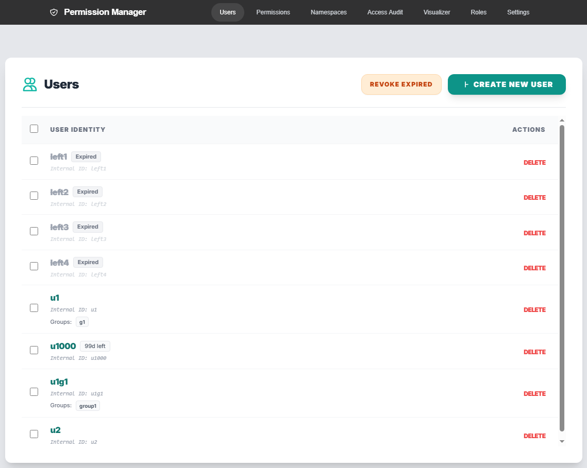
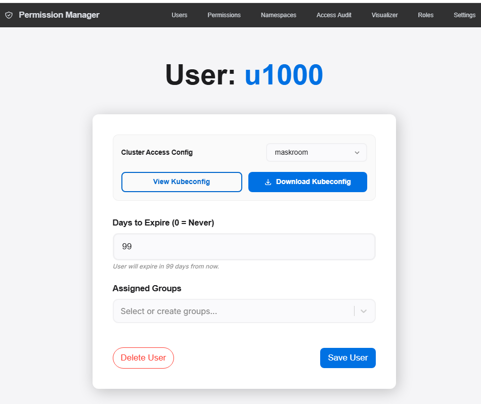
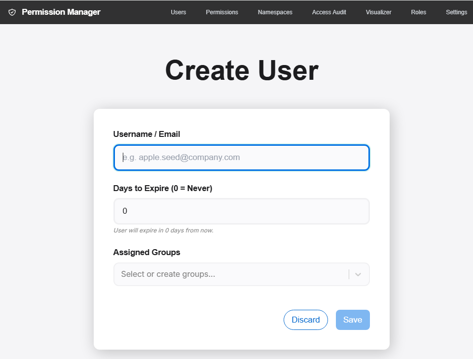
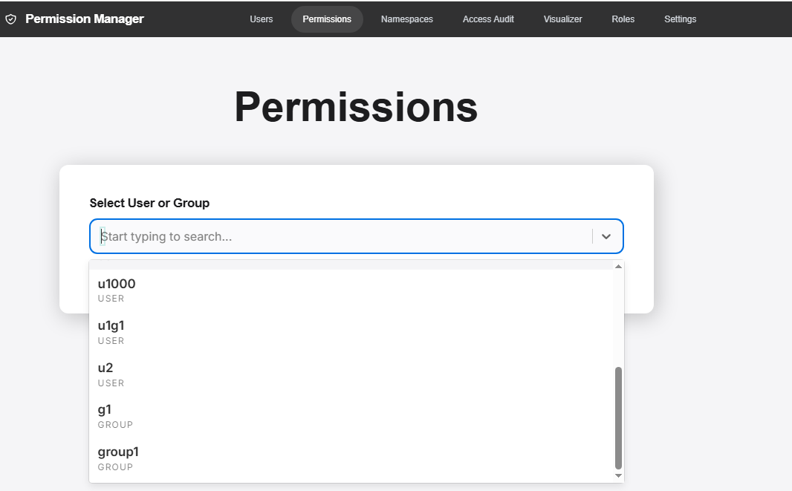
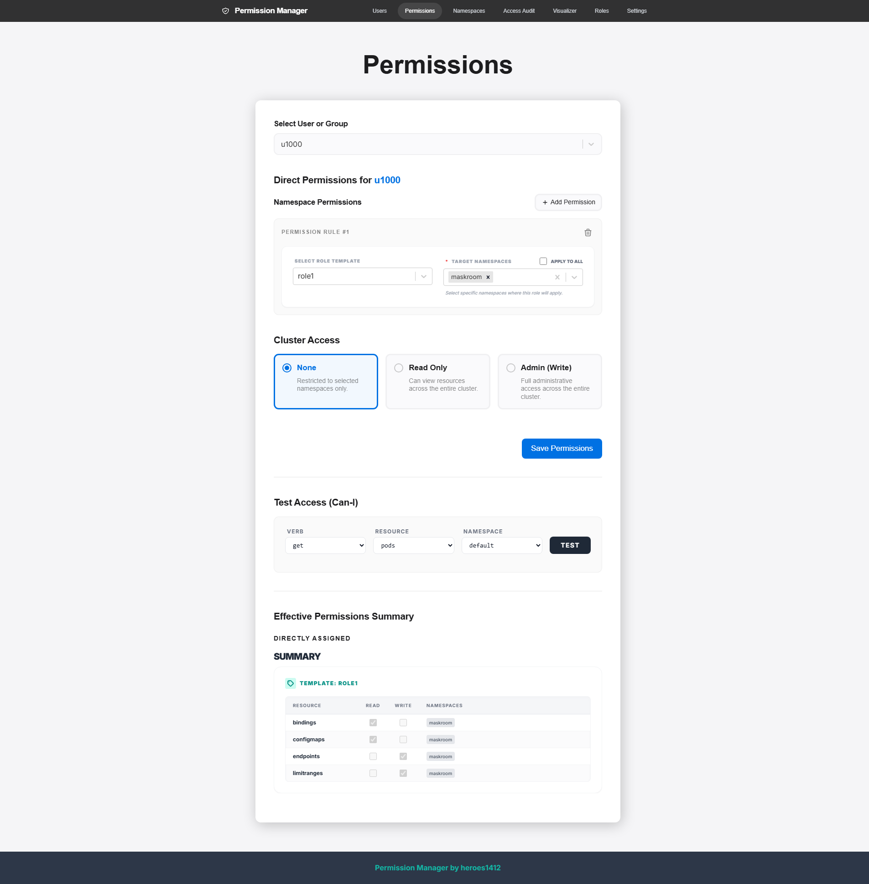
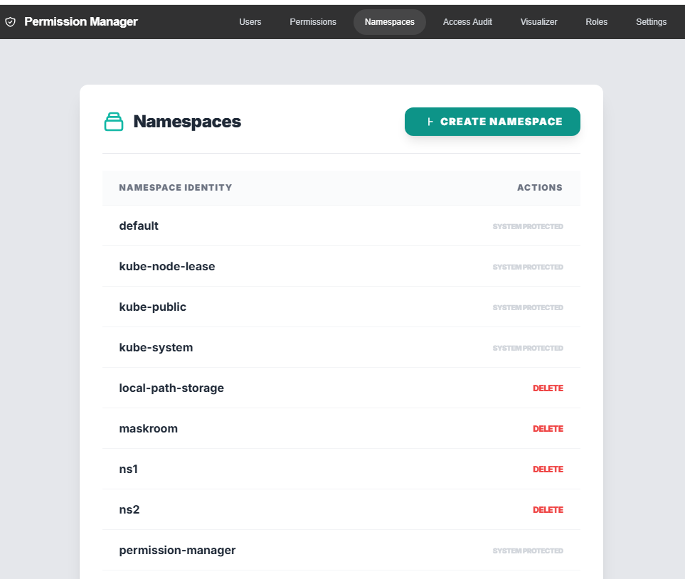
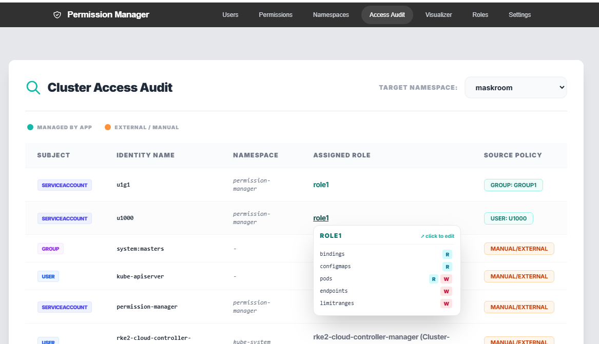
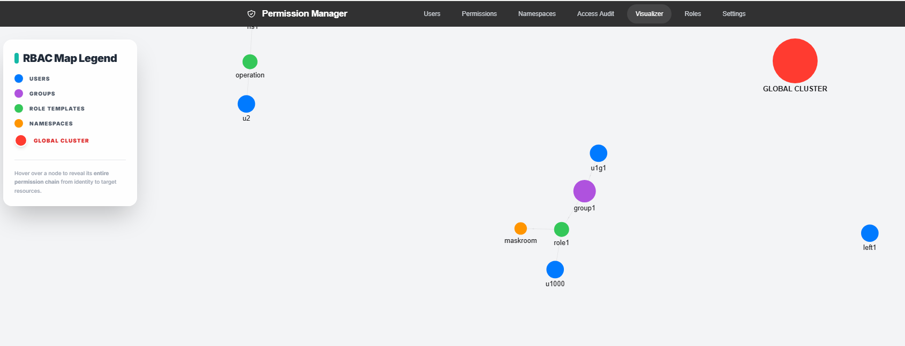
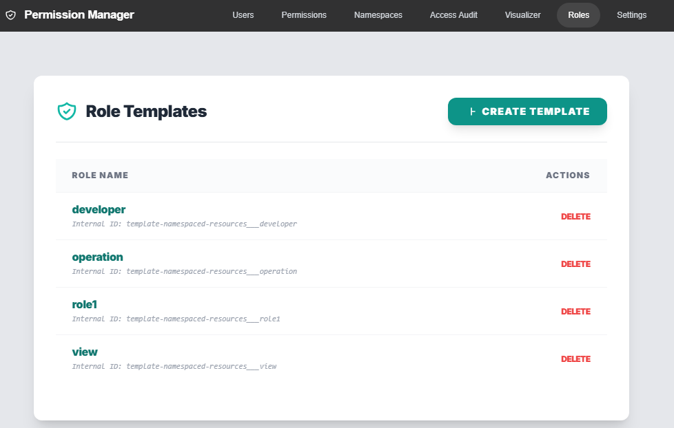

# Permission manager

Welcome to the **Permission Manager**! :tada: :tada:

Permission Manager is an application developed by [SIGHUP](https://sighup.io) that enables a super-easy and user-friendly **RBAC management for Kubernetes**. If you are looking for a simple and intuitive way of managing your users within a Kubernetes cluster, this is the right place.

With Permission Manager, you can create users, assign namespaces/permissions, and distribute Kubeconfig YAML files via a nice&easy web UI.

The lastest image is: h2372/permission-manager:v6

## Changelog tags:
v1: fix some minor bugs, add support for k8s v1.35

v2: fix this, fix that, optimize this, optimize that

v3: fix this, fix that, optimize this, optimize that

v4: Group Features

v5: fix + responsive design

v6: add Access Audit, export gitops resource, web hook, can i

v7: RBAC Visualizer, Bulk Operations + fixes

v8: fix that, fix this ....

docker buildx build --push --platform=linux/arm64,linux/amd64 --tag h2372/permission-manager:v8 .

## Screenshots

### User Management

### User's Kubeconfig / User Settings

### Creating a user

### Permission Manager

### Namespace Management

### Access Audit

### Visualizer

### Role Management

## Installation

To deploy and run the Permission Manager on your cluster, follow the [installation guide](docs/installation.md)

